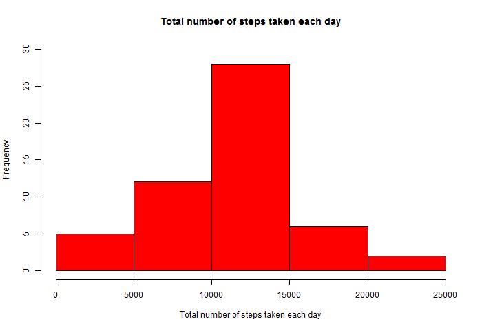

Personal Activity analysis
===========================================

##Downloading, loading and preprocessing the data
1.Before download, create a directory and set as working directory

```r
if(!dir.exists("D:/Coursera/L5W2assignment")){
        (dir.create("D:/Coursera/L5W2assignment"))
}
setwd("D:/Coursera/L5W2assignment")
```
  
2.Download and unzip dataset

```r
data_url<-"https://d396qusza40orc.cloudfront.net/repdata%2Fdata%2Factivity.zip"
download.file(url = data_url,destfile = "./personal_activity.zip")
unzip("./personal_activity.zip")
```
  
2.Load the data(csv file)

```r
filename<-list.files()
act_filename<-grep(pattern="csv$",x=filename,value=TRUE)
activity_data<-read.csv(act_filename,header = T,na.strings = "NA")
library(dplyr)
```
  
3.Coerce the variable "date" to the Date class

```r
activity_data$date<-as.Date(activity_data$date)
```
  
##Part 1: Total number of steps taken per day
1.Calculate the total number of steps taken each day which is shown as below

```r
plot1_data<-summarise(group_by(activity_data,date),totalsteps=sum(steps))
hist(plot1_data$totalsteps,col = "red",
     cex.axis = 0.8,
     main = "Total number of steps taken each day",
     xlab = "Total number of steps taken each day",
     ylab = "Frequency",ylim = c(0,30))
```


  
2.And calculate the mean and median of the total number of steps taken each day

```r
mean(plot1_data$totalsteps,na.rm = TRUE)
```

```
## [1] 10766.19
```

```r
median(plot1_data$totalsteps,na.rm = TRUE)
```

```
## [1] 10765
```
  
##Part 2: The average daily activity pattern  
1.Calculate the average number of daily steps at intervals of 5 minutes and it's shown as below.

```r
plot2_data<-summarise(group_by(activity_data,interval),average_steps=mean(steps,na.rm = TRUE))
plot(x=plot2_data$interval,y=plot2_data$average_steps,
     type="l",col="red",
     xaxp=c(0,2400,12),xlab = "5-minute interval",
     yaxp=c(0,250,5),ylab = "average steps",
     main = "The average number of daily steps of 5-minute interval")
```


  
2.Find the 5-minute interval which contains the maximum number of steps

```r
indice<-grep(max(plot2_data$average_steps,na.rm = TRUE),plot2_data$average_steps)
as.integer(plot2_data[indice,"interval"])
```

```
## [1] 835
```

##Part 3: Imputing missing values
1.Calculate the number of missing value in the dataset at first

```r
missingvalue<-as.list(summary(is.na(activity_data$steps)))
missingvalue[[3]]
```

```
## [1] "2304"
```

2.Fill in all the missing values with the mean for 5-minute interval and get a new dataset

```r
clear_dataset<-merge(activity_data,plot2_data,by="interval")
clear_dataset<-arrange(clear_dataset,date)
rows_NA<-is.na(clear_dataset$steps)
clear_dataset[rows_NA,2]<-clear_dataset[rows_NA,"average_steps"]
clear_dataset<-select(clear_dataset,1:3)
```
  
3.Make a histogram of the total number of steps taken each day

```r
plot3_data<-summarise(group_by(clear_dataset,date),totalsteps=sum(steps))
hist(plot3_data$totalsteps,col = "red",
     main = "Total number of steps taken each day",
     xlab = "Total number of steps taken each day",
     ylab = "Frequency",yaxp=c(0,40,4))
```


  
4.And calculate the mean and median using the new dataset

```r
mean(plot3_data$totalsteps)
```

```
## [1] 10766.19
```

```r
median(plot3_data$totalsteps)
```

```
## [1] 10766.19
```
  
The mean is the same as the estimate in the first part, however the median is a little larger than the estimate from the first part.

##Part 4:Differences in activity patterns between weekdays and weekends
1.Create a new factor variable indicating whether a given day is a weekday or weekend

```r
clear_dataset<-mutate(clear_dataset,
                      weekday=factor(weekdays(date,abbreviate=TRUE),
                                     levels=c("周一","周二","周三","周四","周五","周六","周日")))
levels(clear_dataset$weekday)<-c("weekday","weekday",
                        "weekday","weekday","weekday","weekend","weekend")
```
  
2.Differences in activity patterns between weekdays and weekends are shown as below plot,the activity start at 6 a.m. on weekday, earlier than weekend.And there are more activities during the weekend.

```r
plot4_data<-summarise(group_by(clear_dataset,weekday,interval),average_steps=mean(steps))
library(lattice)
xyplot(average_steps~interval|weekday,data=plot4_data,l
       ayout=c(1,2),type="l",
       xlab = "5-minute interval",ylab = "Number of steps")
```

```
## Error: <text>:4:8: unexpected symbol
## 3: xyplot(average_steps~interval|weekday,data=plot4_data,l
## 4:        ayout
##           ^
```
